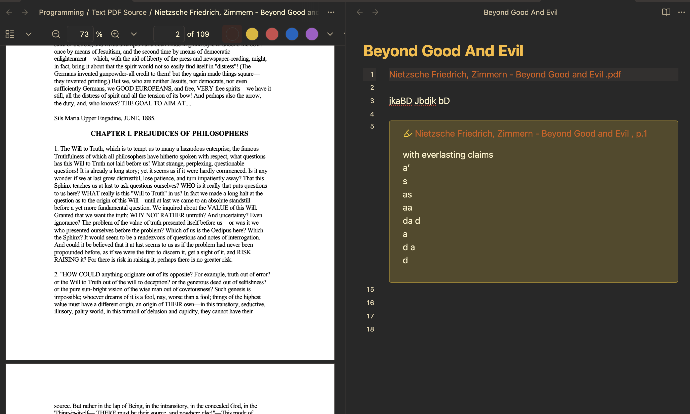

# PDFer4Life

Group Name: PDFer

Group Members: Fasih Javed (fasihj2), Mathew Randal (randal3), Amey Gupta (amey2)

**Project Introduction**

 - This project will be a lightweight pdf viewer allowing split screen reading and note taking, similar to a library program.
  
**Technical Overview**

 - Access users file directory and display pdf files in GUI (checkpoint 1)
  
 - Open and visualizing PDFs (checkpoint 1)
  
 - Access/make text files and edit them through the GUI (checkpoint 2)
  
 - Display PDF and text file side by side (checkpoint 2)
  
 - Connects to pdf sourcing websites, like LibGen, to pull pdfs from (final submission)
  
**Possible Challenges**

 - Dealing with file permissions
  
 - Developing/Implementing a functional GUI
  
 - Managing dual-window functionality
  
**References**

 - The idea behind this project partially stems from Obsidian’s pdfs split screen view

